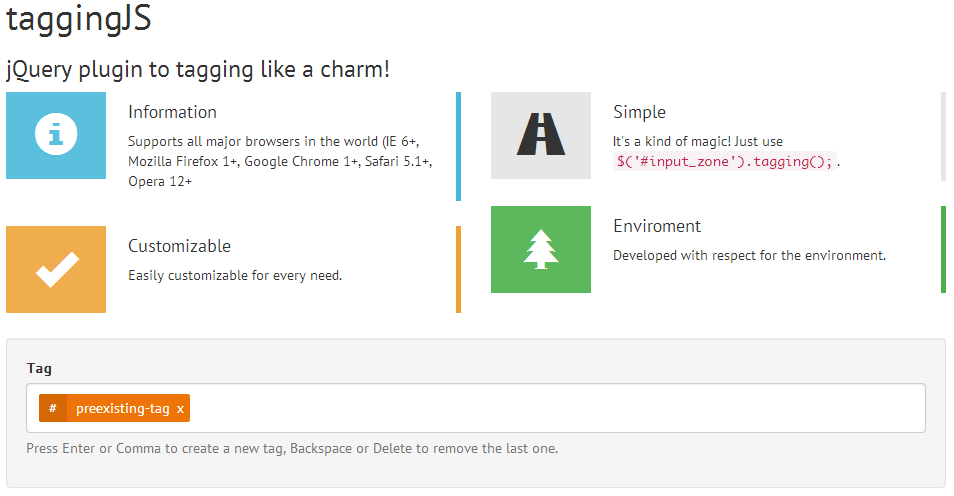

# taggingJS #

[](https://travis-ci.org/sniperwolf/taggingJS)

## jQuery plugin to tagging like a charm! ##

**taggingJS** is a jQuery plugin to create an high customizable front-end tag system.
It is like `5 kb` and [support major browsers](#browser-support) in the world!

Actual version is [`1.3.3`](https://github.com/sniperwolf/taggingJS/releases/tag/v1.3.3).



## Getting Started ##

You can find a working example in [Codepen.io](http://codepen.io/sniperwolf/pen/geFxq/)
or in the project's [GitHub page](http://sniperwolf.github.io/taggingJS/).

### Simplest ###

1. **Download** the `tagging.min.js` file from this repository;

2. **Include** `<script src="path/to/tagging.min.js"></script>` to the bottom of
your page;

3. *Optional* - Include the basic CSS tag style
`<link href="tag-basic-style.css" rel="stylesheet">` to the `<head>` of
your page;

4. **Add** to your page something like
`<div data-tags-input-name="tag" id="tagBox">preexisting-tag</div>`;

5. **Add** to your main JavaScript file `$("#tagBox").tagging();`;

The `data-tags-input-name="tag"` is the `name` attribute used by each input
inside the `tagBox`.

### Manipulate tags with methods ###

Here there are some **common pattern** to manipulate tags inside the tag box:

**N.B.**: `$tag_box` is the tag box object. To get it:

```js
var t, $tag_box;

// We call taggingJS init on all "#tag" divs
t = $( "#tag" ).tagging();

// This is the $tag_box object of the first captured div
$tag_box = t[0];
```

#### Get all tags (object)

```js
// To get all tags inside tag box as an array of String
$tag_box.tagging( "getTags" );
>>> ["preexisting-tag", "another-tag"]

// To get all tags inside tag box as an array of jQuery Object
$tag_box.tagging( "getTagsObj" );
>>> [x.fn.x.init[1], x.fn.x.init[1]]
```

#### Add new tags

```js
// To add a tag with "A new tag added via JS" as text
$tag_box.tagging( "add", "A new tag added via JS" );
>>> true

// To add two tag, one with "tag 1" and the other with "tag 2" as text
$tag_box.tagging( "add", ["tag 1", "tag 2"] );
>>> ["tag 1", "tag 2"]
```

#### Remove a tag

```js
// To remove a tag with text "A new tag added via JS" as text
$tag_box.tagging( "remove", "A new tag added via JS" );
>>> $_obj

// To remove two tag, one with "tag 1" and the other with "tag 2" as text
$tag_box.tagging( "remove", ["tag 1", "tag 2"] );
>>> [$_obj]

// Suppose that $tag is the jQuerify object of a tag inside the tag box, you can also do
$tag_box.tagging( "remove", $tag] );
>>> $_obj
```

#### Remove all tags

```js
// To remove all tags
$tag_box.tagging( "removeAll" );

// or
$tag_box.tagging( "reset" );
```

#### Get Special Keys

```js
// To get special Keys without distinctions
$tag_box.tagging( "getSpecialKeys" );
>>> Object {comma: 188, enter: 13, spacebar: 32, del: 46, backspace: 8}

// To get special Keys with distinctions
$tag_box.tagging( "getSpecialKeysD" );
>>> Object {add: Object, remove: Object}
```

#### Add or Remove a Special Key

```js
// To add the "left arrow" as a special key to add a new tag
$tag_box.tagging( "addSpecialKeys", [ "add", { left_arrow: 37 } ] );

// To add the "right arrow" as a special key to remove a tag
$tag_box.tagging( "addSpecialKeys", [ "remove", { right_arrow: 39 } ] );

// To remove the "right arrow" as a special key
$tag_box.tagging( "removeSpecialKeys", ["remove", 39] );
```

#### Disable taggingJS

```js
// To disable taggingJS
$tag_box.tagging( "destroy" );
```

#### Empty the `type_zone`

```js
// To disable taggingJS
$tag_box.tagging( "emptyInput" );
```

#### Get or Set the value of `type_zone`

```js
// To set "value" as value of the input
$tag_box.tagging( "valInput", "value" );

// To get the value of the input
$tag_box.tagging( "valInput" );
```

#### Trigger Focus event the `type_zone`

```js
// To Trigger Focus event the input
$tag_box.tagging( "focusInput" );
```

#### Detect when a Tag is Added or Removed

```js
// Execute callback when a tag is added
$tag_box.on( "add:after", function ( el, text, tagging ) {
  console.log( "Added tag: ", text );
});

// Execute callback when a tag is removed
$tag_box.on( "remove:after", function ( el, text, tagging ) {
  console.log( "Removed tag: ", text );
});
```

Please, see all [Available Methods](#available-methods).

### Customize ###

There are **several ways** to customize the default behavior of taggingJS:

1. Use a JavaScript `custom_options` object to customize the global taggingJS behavior
(see [First Way](#first-way---global-object));

2. Use `data` attributes in the `tagBox` HTML Markup
(see [Second Way](#second-way---data-attributes));

3. Use a combination of the first two way
(see [Third Way](#third-way---mixed-way));

**N.B.**: Be careful! `data` attributes have an higher priority than the `custom_options` object,
because each `data` attribute overwrite the global behavior.
In other words, the global settings work for all tags box captured, unless in
these are specified `data` attributes (*which may change the behavior*).

####  First Way - Global Object ####

1. **Create a custom options** `object`, like this `my_custom_options` (see [Available Options](#available-options)):

	```js
	var my_custom_options = {
		"no-duplicate": true,
		"no-duplicate-callback": window.alert,
		"no-duplicate-text": "Duplicate tags",
		"type-zone-class": "type-zone",
		"tag-box-class": "tagging",
		"forbidden-chars": [",", ".", "_", "?"]
	};
	```

2. **Create a tag box** (or multiple tag box) like this:

	```html
	<div id="tagBox">preexisting-tag</div>
	```

3. **Add** to your main JavaScript file:

	```js
	$("#tagBox").tagging( my_custom_options );
	```

In this way, we customize the **global behavior** of taggingJS for
**all tag box** caught with selector.

#### Second Way - Data Attributes ####

1. **Create a tag box** with some `data` attributes, like this (see [Available Options](#available-options)):

	```html
	<div
		data-no-duplicate="true"
		data-pre-tags-separator="\n"
		data-no-duplicate-text="Duplicate tags"
		data-type-zone-class="type-zone"
		data-tag-box-class="tagging"
		data-edit-on-delete="true"
	id="tagBox">preexisting-tag</div>
	```

2. **Add** to your main JavaScript file:

	```js
	$("#tagBox").tagging();
	```

**N.B.**: Use data method with `no-duplicate-callback` and `forbidden-chars`
can cause some problems. Avoid it.

#### Third Way - Mixed Way ####

In this way, we **mix** data attributes and options object to customize taggingJS behavior for each tag box.

1. **Create a tag box** with some `data` attributes, like this:

	```html
	<div class="tag-box"
		data-no-duplicate="true"
		data-tags-input-name="tag"
	id="tagBox1">preexisting-tag</div>
	```

2. **Create *another* tag box** with no `data` attributes:

	```html
	<div id="tagBox1" class="tag-box">preexisting-tag</div>
	```

3. **Create a custom options** `object`, like this `my_custom_options` (see [Available Options](#available-options)):

	```js
	var my_custom_options = {
		"no-duplicate": false,
		"tags-input-name": "taggone",
		"edit-on-delete": false,
	};
	```

4. **Add** to your main JavaScript file

	```js
	$(".tag-box").tagging( my_custom_options );
	```

Now you may see that:

* The `#tagBox1` has a behavior that overwrite some `my_custom_options` options:

	- Does not accept duplicate tag (*for the respective `data` attribute*);
	- For each tag, it has `tag` as input name (*for the respective `data` attribute*);
	- On delete, the tag is completely removed (*for the `my_custom_options`*);

* The `#tagBox2` has a behavior dictated only by `my_custom_options`:

	- Accept duplicate tag (*for the `my_custom_options`*);
	- For each tag, it has `tag` as input name (*for the `my_custom_options`*);
	- On delete, the tag is completely removed (*for the `my_custom_options`*);

## Available Options ##

Below there are the **available options to customize taggingJS** with `type`,
a little description and the default value:

| Option | Type | Default | Description |
| ------ | ---- | ------- | ----------- |
| **case-sensitive** | `Boolean` | `false` | If `false`, all text is treated like lowercase. |
| **close-char** | `String` | `"&times;"` | Single Tag close character. |
| **close-class** | `String` | `"tag-i"` | Single Tag close class. |
| **edit-on-delete** | `Boolean` | `true` | `true` to edit tag that has just been removed from tag box. |
| **forbidden-chars** | `Array` | `["," , ".", "_", "?"]` | Array of forbidden characters. |
| **forbidden-chars-callback** | `Function` | `window.alert` | Function to call when is detected a forbidden character. |
| **forbidden-chars-text** | `String` | `"Forbidden character:"` | Basic text passed to `forbidden-chars-callback`. |
| **forbidden-words** | `Array` | `[]` | Array of forbidden words. |
| **forbidden-words-callback** | `Function` | `window.alert` | Function to call when is detected a forbidden words. |
| **forbidden-words-text** | `String` | `"Forbidden word:"` | Basic text passed to `forbidden-words-callback`. |
| **no-backspace** | `Boolean` | `false` | Backspace key remove last tag by default, `true` to avoid that. |
| **no-comma** | `Boolean` | `false` | Comma `","` key add a new tag by default, `true` to avoid that. |
| **no-del** | `Boolean` | `false` | Del key remove last tag by default, `true` to avoid that. |
| **no-duplicate** | `Boolean` | `true` | If `true`, there will be no duplicate tag's name in the tag box. |
| **no-duplicate-callback** | `Function` | `window.alert` | Function to call when is detected a duplicate tag. |
| **no-duplicate-text** | `String` | `"Duplicate tag:"` | Basic text passed to `no-duplicate-callback`. |
| **no-enter** | `Boolean` | `false` | Enter key add a new tag by default, `true` to avoid that. |
| **no-spacebar** | `Boolean` | `false` | Spacebar key add a new tag by default. `true` to avoid that.|
| **pre-tags-separator** | `String` | `", "` | This is used to `split` the initial text and add `preexistint-tag`. By default, you must put new tags using a comma and a space (`", "`). |
| **tag-box-class** | `String` | `"tagging"` | Class of the tag box. |
| **tag-box-editable-class** | `String` | `"editable"` | Class of the tag box when editable, used together with tags-limit option for css targeting. |
| **tag-char** | `String` | `"#"` | Single Tag char. |
| **tag-class** | `String` | `"tag"` | Single Tag class. |
| **tag-on-blur** | `Boolean` | `true` | If `true`, clicking away from the `$type_zone` will add a new tag. |
| **tags-input-name** | `String` | `"tag"` | Name to use as `name=""` in single tags' input. By default, all tags being passed as array like `tag[]`. |
| **tags-limit** | `Integer` | `0` | Limit the number of tags that can be added, zero for no limit. |
| **type-zone-class** | `String` | `"type-zone"` | Class of the type-zone. |

## Available Methods ##

Below there are the **available methods of taggingJS** with a
little description, the argument that it can take and the return `type`:

| Method | Description | Argument | Return |
| ------ | ----------- | -------- | ------ |
| **add( `text` or `[text]` )** | Add a new tag. | A `String` (or an `Array` of `String`) to add as tag, if `null` we get the content of tag box `type_zone`. | `Boolean` or `Funtion` |
| **add:after( `function` )** | Execute the function after add a Tag. | Depends on the `function` used as callback. | `Generic` |
| **addSpecialKeys( `[ "type", obj ]` )** | Add a special keys to add or remove a tag. | `Array` - Where `"type"` is `"add"` or `"remove"`, `obj` is like `{ key_name: key_code }` (it can be also an `Array` of `obj`). | A `String` for error or `Object`  Actually `"type"_key` (`add_key` or `remove_key`). |
| **destroy()** | Remove `type_zone`, all tags and other things. | `void` | `Boolean` |
| **emptyInput()** | Empty tag box's `type_zone`. | `void` | `$_obj` - The jQuerified `type_zone` itself. |
| **focusInput()** | Trigger focus on tag box's `type_zone`. | `void` | `$_obj` - The jQuerified `type_zone` itself. |
| **getDataOptions()** | Get Data attributes custom options. | `void` | `Object` - tag box data attributes custom options. |
| **getSpecialKeys()** | Return all special keys inside an object (without distinction) | `void` | `Object` - All tags as member of strings. |
| **getSpecialKeysD()** | Return all special keys inside an object (with distinction) | `void` | An `Object` with an `add` and `remove` properties. |
| **getTagsObj()** | Return all tags as object | `void` | `Array` - All tags as member of objects. |
| **init()** | Init method to bootstrap all things | `void` | `$_obj` - The jQuerify tag box. |
| **refresh( `text` )** | Remove and insert all tag | A `String` with all tags separated by `pre-tags-separator` option value (if `null`, we call `getTags` method) | `Boolean` |
| **remove( `text` or `$_obj` )** | Remove last tag or the specified ones in tag box's `type_zone`. | A `String` or `$_obj` (or an `Array` of them) of the tag to remove. | A `String` with error message  or `$_obj` of the removed tag. |
| **remove:after( `function` )** | Execute the function after remove a Tag. | Depends on the `function` used as callback. | `Generic` |
| **removeAll()** | Alias of reset | `void` | `Array` - All removed tags. |
| **removeSpecialKeys( `[ "type", obj ]` )** | Remove a special key . | `Array` - Where `"type"` is `"add"` or `"remove"`, `obj` is like `{ key_name: key_code }` (it can be also an `Array` of `obj`). | `Object` -  Actually `"type"_key` (`add_key` or `remove_key`). |
| **reset()** | Remove all tags from tag box's `type_zone` | `void` | `Array` - All removed tags. |
| **valInput( `text` )** | Get or set the tag box `type_zone`'s value | A `String` to put as tag box `type_zone`'s value. | The value `String` or `$_obj` of tag box's `type_zone`. |

You can find example [here](#manipulate-tags).

## Contribute ##

### Set Up nodeJS and Grunt ###

1. Fork the repository;

2. Open a shell in project's directory;

3. Type `npm install` (make sure you have installed [nodeJS](http://nodejs.org));

4. Type `grunt` to execute the default script (without minification),
`grunt dist` to also minify the script (make sure you have installed [Grunt](http://gruntjs.com)).

### JavaScript Style Guide ###

I follow the [jQuery's JavaScript style guide](https://contribute.jquery.org/style-guide/js/),
please follow it you too :D

Also take a look to [IdiomaticJS](https://github.com/rwaldron/idiomatic.js/)
(**Principles of Writing Consistent, Idiomatic JavaScript**).

## Requirements ##

- **jQuery** (`1.5.X` or more, also `2.X` works);

## Browser Support ##

Supports all major browsers in the world (`IE 6+`, `Mozilla Firefox 1+`,
`Google Chrome 1+`, `Safari 5.1+`).

## License ##

(C) Fabrizio Fallico 2014, released under the [MIT license](LICENSE.md).

## Changelog (v1.3.X) ##

### 1.3.3 - [Oct 24, 2014]

* Now you can add tags clicking away from the `$type_zone` (see [Available Options](#available-options)).
* Fix [#22](https://github.com/sniperwolf/taggingJS/issues/22), Fix [#24](https://github.com/sniperwolf/taggingJS/issues/24), Fix [#26](https://github.com/sniperwolf/taggingJS/issues/26), Fix [#28](https://github.com/sniperwolf/taggingJS/issues/28) issues.

### 1.3.1 - [Apr 28, 2014]

* Radically changed the architecture of the plugin. Now we are more flexible to changes and pull requests.
* Added basic methods.
* Now you can add (and remove) custom special keys to add or remove tags (see [Available Methods](#available-methods)).
* Fix [#6](https://github.com/sniperwolf/taggingJS/issues/6), [#8](https://github.com/sniperwolf/taggingJS/issues/8), [#16](https://github.com/sniperwolf/taggingJS/issues/16), [#17](https://github.com/sniperwolf/taggingJS/issues/17), [#19](https://github.com/sniperwolf/taggingJS/issues/19) issues.
